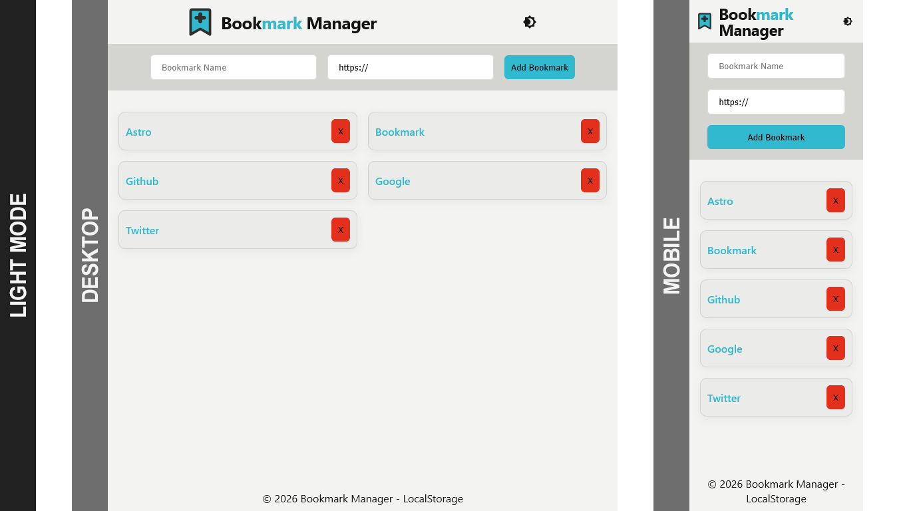
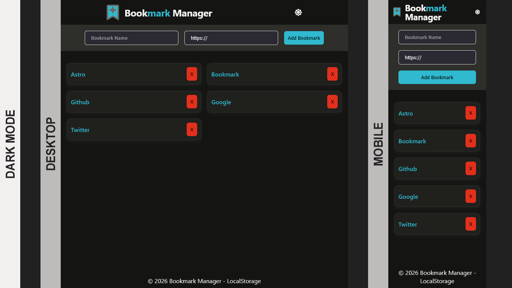

# Bookmark Manager - FCC

This is a simple Bookmark Manager project using HTML, CSS, and JS.

# Table of contents

- [Bookmark Manager - FCC](#bookmark-manager---fcc)
    - [Table of contents](#table-of-contents)
    - [Screenshots](#screenshots)
    - [My process](#my-process)
        - [Built with](#built-with)
    - [Author](#author)

## Screenshots

Light mode screenshots of desktop & mobile

Dark mode screenshots of desktop & mobile

## My process

Like most projects, always start with the small wins. Create the basic HTML file. Style to a point where it looks okay, as one can make other tweaks along the way. For the script, started with:

1. Adding a bookmark to local storage
1. Updating the bookmark list with the newly added bookmark
1. Actually, displaying the bookmark list on load
1. Sorting the bookmark list and checking for duplicate bookmarks with the same URL
1. Removing or deleting bookmarks
1. Adding search and sort controls
1. Adding tags and URL to display with each bookmark element

### Built with

- Semantic HTML5 markup
- CSS custom properties
- CSS Grid & Flex
- Javascript

## Author

- [@davejnicol](https://github.com/davejnicol)
